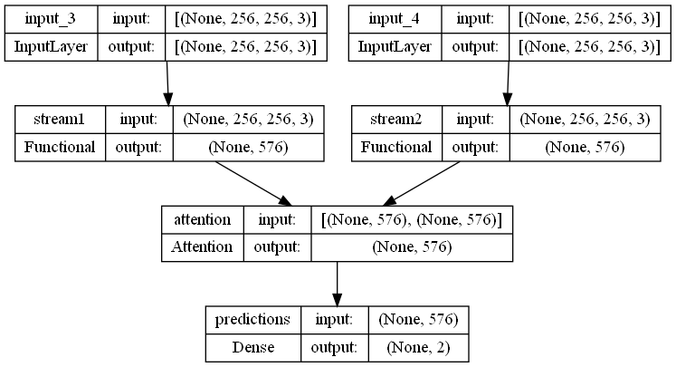

## Attention-Based Two-Stream Convolutional Networks for Face Spoofing Detection

This repo implements the idea from this paper: [https://pureadmin.qub.ac.uk/ws/portalfiles/portal/174233508/Attention_Based_Two_Stream_Convolutional_Networks_for_Face_Spoofing_Detection.pdf](https://pureadmin.qub.ac.uk/ws/portalfiles/portal/174233508/Attention_Based_Two_Stream_Convolutional_Networks_for_Face_Spoofing_Detection.pdf). The core motive behind this paper was to create a model which would be insensitive to illumination in detecting spoofing attacks.

This repo will be explained in 5 sections: 

1. Data
 2. CNN Backbone
 3. Retinex Function
 4. Train
 5. Inference

## Data
Given one input image:
1. Use MTCNN for face and landmark detection
2. Align detected faces using affine transformation to size $128 \times 128$
3. If in training mode, apply data augmentation including horizontal flipping, random rotation ($0$-$20$ degree), and random crop ($114 \times 114$).
4. Generate MSR (multiscale retinex) image from RGB image

Training params:
- Momentum: $0.9$
- Learning rate: $10^{-4}$
- Batch size: $128$
- Number of epoch to converge: $50$

Training and testing images are stored in test and train folders respectively. The folder will be organised as such:
videos

```
    train
	    └── real
	    	    └── real1.jpg
	    	    .
	    	    .
	    └── fake
	    	    └── fake1.jpg
	    	    .
	    	    .
    test
	    └── real
	    └── fake
```

### Extract data
cmd:
```
$ python scripts/extract_all.py  --source <> --dest <> --sampling-ratio <> --extract-type <>
```
params:
- source: path of source data
- dest: path of destination image store
- sampling-ratio: specify a ratio x for frame sampling (0 < x <= 1)
- extract-type: choices in {all, frame, face}, default=all

For example:
```
$ python scripts/extract_all.py  --source ./data/ --dest ./data_extract/ --sampling-ratio 0.5 --extract-type all
```
If file structer of source folder '''./data/''' is as such:
```
    data
	    └── real
	    	    └── real1.mp4
					.
					.
	    └── fake
	    	    └── fake1.jpg
					.
					.
```
Then file structer of source folder '''./data_extract/''' is as such:
```
    data
		└── face_crop
					└── real
							└── real1_0000.png
								real1_0005.png
								.
								.
					└── fake
							└── fake1_0000.png
								fake1_0005.png
								.
								.
		└── landmark
					└── real
							└── real1_0000_landmark.png
								real1_0005_landmark.png
								.
								.
					└── fake
							└── fake1_0000_landmark.png
								fake1_0005_landmark.png
								.
								.
```


## CNN Backbone

As shown in the image below, a CNN is needed in the MSR and RGB stream. I have decided to proceed with MobileNetV3 taken from [https://github.com/xiaochus/MobileNetV3](https://github.com/xiaochus/MobileNetV3) due to its lightweight architecture.


This backbone can be substituted with any of the backbones here: [https://keras.io/api/applications/](https://keras.io/api/applications/).

## Retinex Function

The Multi-Scale Retinex (MSR) functions have been taken from: [https://github.com/dongb5/Retinex](https://github.com/dongb5/Retinex). The core idea behind the use of MSR is written in the paper: 

> MSR can separate an image to illumination component and reflectance
> component, and the illuminationremoved reflectance component is used
> for liveness detection

## Train

Model structure:



To carry out training, a custom DataGenerator is needed as well as the Attention layer used in the paper. 

The custom DataGenerator is found in `datagen.py` and it generates batches of images in the format **[BxHxWxC RGB image, BxHxWxC MSR image]** as shown in the image below.


The Attention-based Fusion stated in the paper can be found in `attention.py`. The inner working of the layer can be seen in the image below.


Example training command:
```
$ python train.py --bs 128 --dim 128 --backbone Xception --num-workers 8
```

For evaluate model, use this command:
```
$ python eval.py --bs 20 --dim 128 --backbone Xception --num-classes 1 --weight weights/train/weight-02-1.00-1.00-0.00061.hdf5
```

## Test
To test the model using your webcam, run the following command: `python test.py`

## Slurm
For those who run script in batch system:
- Extract frame from dataset
```
$ sbatch extract_train.slurm
$ sbatch extract_test.slurm
```
- See job queue
```
$ squeue --format="%.18i %.9P %.30j %.8u %.8T %.10M %.9l %.6D %R" --me
```
- Cancel a job
```
$ scancel <job-id>
```
